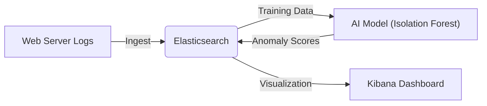

# BÁO CÁO DỰ ÁN: HỆ THỐNG PHÁT HIỆN BẤT THƯỜNG LOG WEB SERVER VỚI ELK STACK VÀ AI

---

## MỤC LỤC

1. [Giới thiệu](#1-giới-thiệu)
2. [Kiến thức nền tảng](#2-kiến-thức-nền-tảng)
3. [Kiến trúc hệ thống](#3-kiến-trúc-hệ-thống)
4. [Môi trường và Cài đặt](#4-môi-trường-và-cài-đặt)
5. [Chi tiết triển khai](#5-chi-tiết-triển-khai)
6. [Hướng dẫn vận hành](#6-hướng-dẫn-vận-hành)
7. [Kết quả thực nghiệm](#7-kết-quả-thực-nghiệm)
8. [Kết luận](#8-kết-luận)
9. [Tài liệu tham khảo](#9-tài-liệu-tham-khảo)

---

## 1. Giới thiệu

### 1.1. Mục tiêu dự án

Xây dựng một hệ thống giám sát và phân tích log web server tự động, tích hợp trí tuệ nhân tạo (AI) để phát hiện các hành vi bất thường (anomalies) mà các phương pháp dựa trên luật (rule-based) truyền thống có thể bỏ sót.

### 1.2. Phạm vi

Dự án tập trung vào việc thu thập log truy cập web, lưu trữ tập trung trên ELK Stack, và áp dụng thuật toán học máy (Isolation Forest) để phân loại log bình thường và bất thường.

---

## 2. Kiến thức nền tảng

### 2.1. ELK Stack

ELK Stack là bộ công cụ mã nguồn mở phổ biến để quản lý log, bao gồm:

- **Elasticsearch**: Công cụ tìm kiếm và phân tích dữ liệu phân tán, đóng vai trò là cơ sở dữ liệu chính lưu trữ log.
- **Logstash**: Pipeline xử lý dữ liệu phía server, dùng để thu thập, chuyển đổi và gửi dữ liệu vào Elasticsearch.
- **Kibana**: Giao diện người dùng để trực quan hóa dữ liệu từ Elasticsearch dưới dạng biểu đồ, bảng biểu.

### 2.2. Isolation Forest (Rừng cô lập)

Là thuật toán học máy không giám sát (unsupervised learning) chuyên dùng để phát hiện bất thường.

- **Nguyên lý**: Các điểm dữ liệu bất thường thường "ít" và "khác biệt". Thuật toán sẽ xây dựng các cây quyết định ngẫu nhiên; các điểm bất thường sẽ nằm gần gốc cây hơn (dễ bị cô lập hơn) so với các điểm dữ liệu bình thường.
- **Ưu điểm**: Hiệu quả với dữ liệu nhiều chiều, không cần gán nhãn trước.

---

## 3. Kiến trúc hệ thống

### 3.1. Sơ đồ luồng dữ liệu



### 3.2. Cấu trúc thư mục dự án

```
project_clean/
├── docker-compose.yml     # Cấu hình Docker cho ELK Stack
├── logstash.conf          # Cấu hình pipeline Logstash (tùy chọn)
├── requirements.txt       # Danh sách thư viện Python
├── ingest_data.py         # Script nạp dữ liệu vào Elasticsearch
├── train_model.py         # Script huấn luyện mô hình AI
├── detect_anomalies.py    # Script phát hiện bất thường và index kết quả
├── data/
│   └── sample_logs.csv    # Dữ liệu mẫu
└── model.pkl              # File mô hình đã huấn luyện (sinh ra sau khi chạy)
```

---

## 4. Môi trường và Cài đặt

### 4.1. Yêu cầu hệ thống

- **OS**: Windows/Linux/MacOS (Dự án chạy trên Windows).
- **Phần mềm**:
  - Docker & Docker Compose.
  - Python 3.8 trở lên.

### 4.2. Cấu hình Docker (`docker-compose.yml`)

File cấu hình `docker-compose.yml` định nghĩa 3 dịch vụ chính: Elasticsearch, Kibana và Logstash.

```yaml
version: "3.7"

services:
  elasticsearch:
    image: docker.elastic.co/elasticsearch/elasticsearch:8.5.3
    environment:
      - discovery.type=single-node
      - ES_JAVA_OPTS=-Xms1g -Xmx1g
      - xpack.security.enabled=false
    ports:
      - "9200:9200"
    volumes:
      - esdata:/usr/share/elasticsearch/data

  kibana:
    image: docker.elastic.co/kibana/kibana:8.5.3
    depends_on:
      - elasticsearch
    ports:
      - "5601:5601"

  logstash:
    image: docker.elastic.co/logstash/logstash:8.5.3
    depends_on:
      - elasticsearch
    volumes:
      - ./logstash.conf:/usr/share/logstash/pipeline/logstash.conf
      - ./data:/usr/share/logstash/pipeline/data
    ports:
      - "5044:5044"
      - "5000:5000"

volumes:
  esdata:
    driver: local
```

### 4.3. Thư viện Python (`requirements.txt`)

Các thư viện chính được sử dụng:

- `pandas`: Xử lý dữ liệu dạng bảng.
- `scikit-learn`: Cung cấp thuật toán Isolation Forest.
- `elasticsearch<9`: Client kết nối Elasticsearch (lưu ý sử dụng phiên bản < 9 để tương thích với server 8.x).
- `joblib`: Lưu và tải mô hình đã huấn luyện.

### 4.4. Dữ liệu mẫu (`data/sample_logs.csv`)

Dữ liệu đầu vào là file CSV mô phỏng log truy cập web server, bao gồm các trường thông tin sau:

| Tên trường      | Kiểu dữ liệu | Mô tả                            | Ví dụ                         |
| :-------------- | :----------- | :------------------------------- | :---------------------------- |
| `timestamp`     | Date/Time    | Thời gian xảy ra request         | `2025-11-23 12:00:01`         |
| `src_ip`        | String       | Địa chỉ IP nguồn (người dùng)    | `192.168.1.10`                |
| `dst_ip`        | String       | Địa chỉ IP đích (server)         | `10.0.0.1`                    |
| `method`        | String       | Phương thức HTTP                 | `GET`, `POST`                 |
| `url`           | String       | Đường dẫn tài nguyên truy cập    | `/index.html`, `/login`       |
| `status`        | Integer      | Mã trạng thái HTTP               | `200` (OK), `404` (Not Found) |
| `response_time` | Float        | Thời gian phản hồi (giây)        | `0.123`                       |
| `bytes`         | Integer      | Kích thước dữ liệu trả về (byte) | `1024`                        |

Dữ liệu này được sử dụng cho cả quá trình huấn luyện mô hình (Training) và kiểm thử phát hiện bất thường (Inference).

---

## 5. Chi tiết triển khai

### 5.1. Thu thập dữ liệu (`ingest_data.py`)

Script này chịu trách nhiệm đọc dữ liệu log từ file CSV và đẩy vào Elasticsearch. Sử dụng `helpers.bulk` để tối ưu hiệu suất nạp dữ liệu lớn.

```python
import argparse
import pandas as pd
from elasticsearch import Elasticsearch, helpers

def ingest(file_path: str, index_name: str, es_host: str = 'http://localhost:9200', batch_size: int = 5000) -> None:
    es = Elasticsearch(es_host)
    df = pd.read_csv(file_path)
    actions = []
    count = 0
    for _, row in df.iterrows():
        doc = {
            '_op_type': 'index',
            '_index': index_name,
            '_source': {
                'timestamp': row['timestamp'],
                'src_ip': row['src_ip'],
                'dst_ip': row['dst_ip'],
                'method': row['method'],
                'url': row['url'],
                'status': int(row['status']),
                'response_time': float(row['response_time']),
                'bytes': int(row['bytes'])
            }
        }
        actions.append(doc)
        if len(actions) >= batch_size:
            helpers.bulk(es, actions)
            count += len(actions)
            actions = []
    if actions:
        helpers.bulk(es, actions)
        count += len(actions)
    print(f"Indexed {count} documents into index '{index_name}'")
```

### 5.2. Huấn luyện mô hình (`train_model.py`)

Script này thực hiện tiền xử lý dữ liệu và huấn luyện mô hình Isolation Forest.

```python
import argparse
import pandas as pd
from sklearn.ensemble import IsolationForest
from sklearn.preprocessing import StandardScaler
import joblib

def train_model(file_path: str, model_path: str, contamination: float) -> None:
    df = pd.read_csv(file_path)
    # Chọn đặc trưng số
    features = df[['status', 'response_time', 'bytes']].fillna(0)

    # Chuẩn hóa dữ liệu
    scaler = StandardScaler()
    X = scaler.fit_transform(features)

    # Huấn luyện mô hình
    clf = IsolationForest(n_estimators=200, contamination=contamination, random_state=42)
    clf.fit(X)

    # Lưu model và scaler
    joblib.dump({'model': clf, 'scaler': scaler}, model_path)
    print(f"Model saved to {model_path}")
```

### 5.3. Phát hiện bất thường (`detect_anomalies.py`)

Script này tải mô hình đã huấn luyện để phân tích dữ liệu mới, sau đó index kết quả (bao gồm nhãn bất thường) ngược lại vào Elasticsearch để trực quan hóa.

```python
import argparse
import pandas as pd
import joblib
from elasticsearch import Elasticsearch, helpers

def detect(file_path: str, model_path: str, output_path: str, index_results: bool, es_index: str, es_host: str) -> None:
    # Tải model
    model_data = joblib.load(model_path)
    clf = model_data['model']
    scaler = model_data['scaler']

    # Đọc và xử lý dữ liệu
    df = pd.read_csv(file_path)
    features = df[['status', 'response_time', 'bytes']].fillna(0)
    X = scaler.transform(features)

    # Dự đoán
    df['anomaly_score'] = clf.decision_function(X)
    df['anomaly_label'] = clf.predict(X)
    df.to_csv(output_path, index=False)

    # Index vào Elasticsearch
    if index_results:
        es = Elasticsearch(es_host)
        # Tạo index với mapping (lược bỏ chi tiết mapping để ngắn gọn)
        if not es.indices.exists(index=es_index):
             # ... (code tạo index mapping)
             es.indices.create(index=es_index, body=mapping)

        # Bulk index
        actions = []
        for _, row in df.iterrows():
            doc = row.to_dict()
            action = {'_index': es_index, '_source': doc}
            actions.append(action)
        helpers.bulk(es, actions)
```

---

## 6. Hướng dẫn vận hành

### Bước 1: Khởi động hệ thống

```bash
docker-compose up -d
```

> **[CHÈN HÌNH ẢNH TERMINAL: KẾT QUẢ LỆNH DOCKER PS TẠI ĐÂY]**

### Bước 2: Cài đặt môi trường Python

```bash
python -m venv venv
.\venv\Scripts\activate
pip install -r requirements.txt
```

### Bước 3: Nạp dữ liệu mẫu

```bash
python ingest_data.py --file data/sample_logs.csv --index web-logs
```

> **[CHÈN HÌNH ẢNH TERMINAL: KẾT QUẢ INGEST DATA TẠI ĐÂY]**

### Bước 4: Huấn luyện mô hình

```bash
python train_model.py --file data/sample_logs.csv --model-file model.pkl
```

> **[CHÈN HÌNH ẢNH TERMINAL: KẾT QUẢ TRAIN MODEL TẠI ĐÂY]**

### Bước 5: Chạy phát hiện bất thường và Index kết quả

```bash
python detect_anomalies.py --file data/sample_logs.csv --model-file model.pkl --output anomaly_scores.csv --index-results
```

> **[CHÈN HÌNH ẢNH TERMINAL: KẾT QUẢ DETECT ANOMALIES TẠI ĐÂY]**

---

## 7. Kết quả thực nghiệm

### 7.1. Kết quả phát hiện

Hệ thống đã phân tích thành công các dòng log và gán nhãn.

- **Log bình thường**: Các request có status 200, thời gian phản hồi thấp.
- **Log bất thường**: Các request có status lỗi (404, 500), thời gian phản hồi cao đột biến hoặc kích thước gói tin bất thường.

### 7.2. Trực quan hóa trên Kibana

Đã thiết lập **Data View** `web-logs-anomalies-view` trên Kibana để theo dõi kết quả.

**(Vui lòng chèn hình ảnh chụp màn hình Kibana Discover tại đây)**

> **[CHÈN HÌNH ẢNH KIBANA DISCOVER HIỂN THỊ ANOMALY_LABEL TẠI ĐÂY]** > _Hình 1: Giao diện Discover hiển thị các log được gán nhãn bất thường (anomaly_label: -1)_

**(Vui lòng chèn hình ảnh biểu đồ nếu có)**

> **[CHÈN HÌNH ẢNH KIBANA DASHBOARD/CHART TẠI ĐÂY]** > _Hình 2: Biểu đồ phân bố các request bất thường theo thời gian_

---

## 8. Kết luận

Dự án đã xây dựng thành công quy trình khép kín từ thu thập log, lưu trữ, phân tích bằng AI và trực quan hóa kết quả.

- **Ưu điểm**: Tự động hóa quy trình phát hiện lỗi, không phụ thuộc vào các luật cứng nhắc.
- **Hạn chế**: Cần dữ liệu sạch để huấn luyện ban đầu; mô hình cần được cập nhật định kỳ.
- **Hướng phát triển**: Tích hợp Alerting để gửi cảnh báo qua Email/Slack khi phát hiện bất thường thời gian thực.

---

## 9. Tài liệu tham khảo

1. [DevOps VN - Thu thập dữ liệu với Logstash](https://devops.vn/posts/bai-2-thu-thap-du-lieu-voi-logstash/)
2. [GitHub - Analyzing Alerts with ELK Stack](https://github.com/ItaloHugoMDS/Analyzing_Alerts_with_ELK_Stack)
3. [ResearchGate - A Survey on Log Analysis with ELK Stack](https://www.researchgate.net/publication/354608891_A_SURVEY_ON_LOG_ANALYSIS_WITH_ELK_STACK_TOOL)
4. [Eyer.ai - Mastering Anomaly Detection with ELK Stack](https://www.eyer.ai/blog/mastering-anomaly-detection-with-the-elk-stack-techniques-and-best-practices/)
5. [UNB Datasets](https://www.unb.ca/cic/datasets/index.html)
